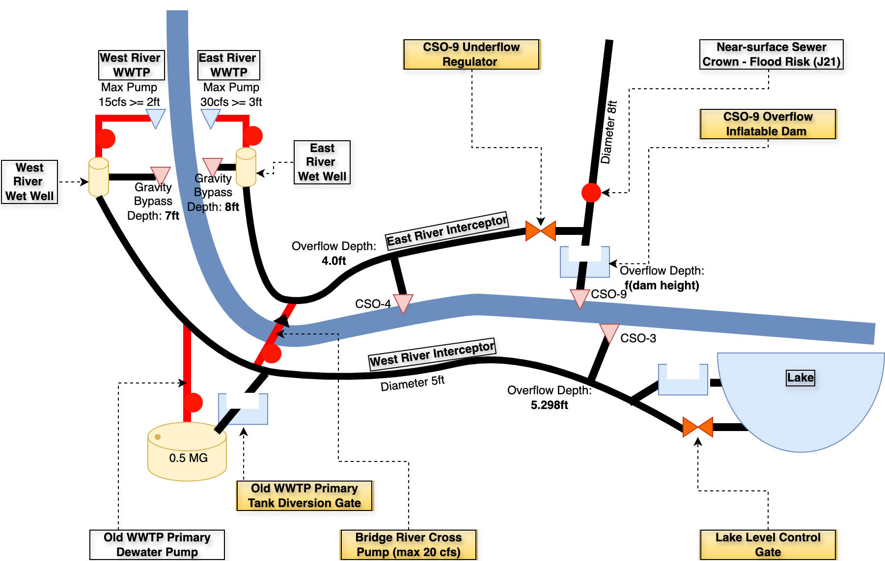
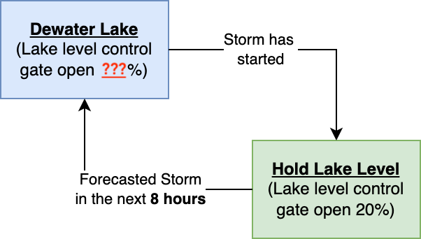
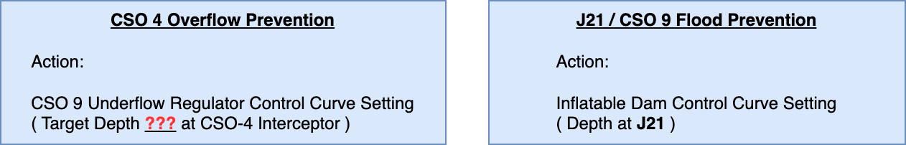
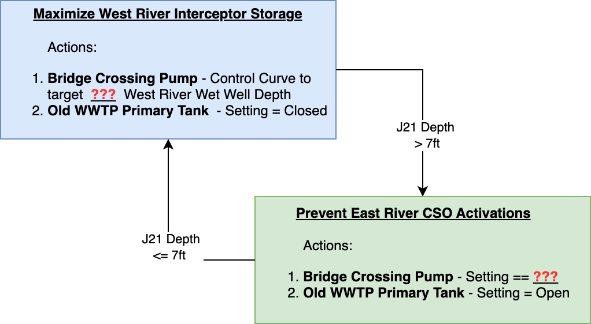
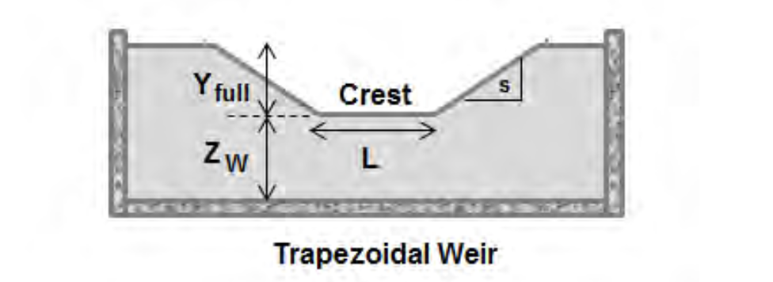
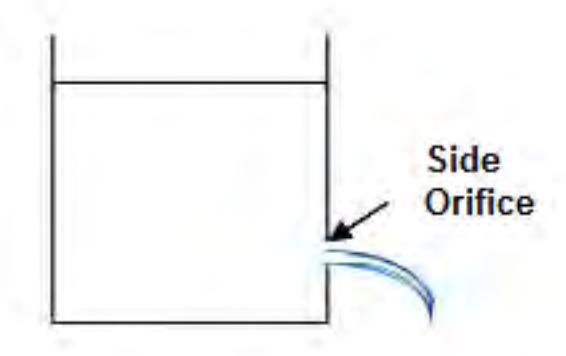
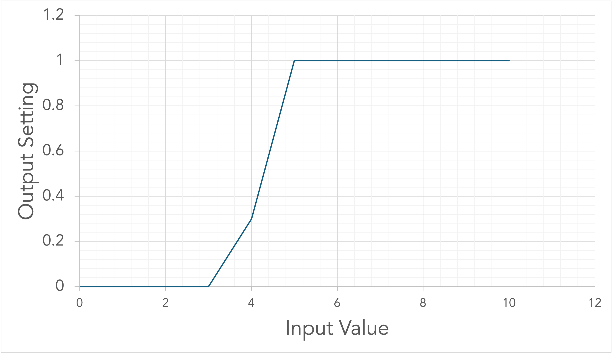

# WEF Collection Systems and Stormwater Conference 2024 - Workshop A: Smart Sewer Applications and Utility Experiences

Date: April 9th, 2024

Document Author(s): Bryant E. McDonnell - [Hydroinformatics, LLC](https://www.hydroinformatics.io), Constantine Karos - [Xylem](www.xylem.com), Luis Montestruque, [HydroDigital, LLC](https://www.hydrodigital.com/), Dayton Marchese, [OptiRTC](https://www.optirtc.com/), and Michael Tryby, USEPA

Copyright (c) 2024: Hydroinformatics, LLC (https://www.hydroinformatics.io)

License: MIT License

Objective: Workshop Interactive Elements for Simulating Network Real Time Controls

Accompanying Google Collab Notebook:

https://colab.research.google.com/drive/17u3CChouSLJPMtJqYV-S1Fnyl2q4uMZU?usp=sharing

---

The code and model were developed for the Water Environment Federation - Collection Systems and Stormwater Conference 2024. This concept was to create a real-world hydrologic and hydraulic network with some adverse hydraulic conditions (flooding, surcharging, combined sewer overflows). The attendees of the workshop will be guided to develop and leverage <u>existing</u> system assets within the hydraulic network by use of real time controls.

This scope of this code is to run the model as well as be a space where new control logic can be developed to operate the various controllable facilities.

---

### System Layout


*Figure 1: Map of Hartfordville. This figure illustrates the peak network asset utilization (red indicating the fullest pipes >80% and green indicating the least utilized pipes.*




*Figure 2: Schematic version of the network which illustrates the control points available to manipulate (yellow flagged labeled sites).*

#### Key System Layout Details

- The city if serviced by two WWTPs
  - West River at 15 CFS peak | Gravity by-pass at 7ft wet-well depth
  - East River at 30 CFS peak | Gravity by-pass at 8ft wet-well depth
- Three Combined Sewer Overflow points:
  - North side of the river - CSO-4 and CSO-9. CSO-4 is on the East River Interceptor and CSO-9 was the end of the original sewer ages ago where they did some primary treatment before they built the East River TP.
  - South side of the river - CSO-3 situated on the West River Interceptor
- Nearby the river crossing the Old WWTP Primary Tanks are still connected to the system as "gravity flow in", "pump out." However, they are not used too frequently since there is a base cleaning cost ($7,000 per event). They can be used during emergencies. This tank is approximately 0.5MG capacity of usable storage.
- River Crossing (can be pumped from South to the North side of the river). This was built when they were in the process of decommissioning the "Old WWTP" and after they expanded the East River TP
- The city drinking water reservoir is in the Southeast of town and has a dewater control gate as well as an emergency overflow. Due to topography, the emergency overflow runs into the combined sewer system. There is also a railroad running along the southern shoreline with limits build opportunities. This lake has a continuous flow coming in all the time. 

#### Hydraulic Constraint Challenges (Existing SOP)

- The city has no real time telemetered sensor data coming in and this is the reason they have opted for static control settings.
- Due to the side of the river, the West River TP is unable to procure the permit to discharge more.
- CSO-9 has an inflatable dam to limit overflow but the city does not have a good strategy in place to mange this asset and therefore leave it statically set. Every storm event that passes, a new adjustment is made.
- All CSOs use a brick to determine whether an overflow has occurred.
- The River Crossing Pump remains off since they do not have a good handle on preventing CSO4 from activating.

#### Compliance Objectives

- Zero Flooding (Flow surfacing and coming up out of the top of a maintenance hole)
- Zero CSO activations for the 1year storm event. Regulated by overflow site and fined $8,000 per activation. Activation == Overflow Volume > 0.001 MG.
- Zero Gravity bypasses at both WWTPs ($10,000 per occurrence)

## Current Conditions - Static Settings

The static settings for the various pieces of infrastructure are as follows:

- Lake Level Control Gate - Orifice; 10% open
- CSO-9 Overflow (The inflatable dam) - Weir; 50% open
- CSO-9 Underflow Regulator - Orifice; 100% open
- Bridge River Cross Pump - Pump; Off

The results for the current 1-year SCS-Type-3 Compliance Storm event are as follows:

| Volume Type              | No Control (MG) | Fine ($)    |
| ------------------------ | :-------------: | ----------- |
| CSO3                     |      0.032      | $8,000      |
| CSO4                     |      0.000      |             |
| CSO9                     |      0.615      | $8,000      |
| WESTRIVER_TP             |     38.231      |             |
| WESTRIVER_GRAVITY_BYPASS |      4.246      | $10,000     |
| EASTRIVER_TP             |     32.557      |             |
| EASTRIVER_GRAVITY_BYPASS |      0.000      |             |
| FLOODING_VOLUME (KGal)   |      0.068      |             |
| **TOTAL COST**           |                 | **$26,000** |


## With Dynamic Control Strategy

One of the most important aspects of designing a coordinated control strategy for a network is to understand the constraints and bottlenecks within the network.  These are usually things like smaller pipes and sewer overflow points.  Once understood, we can begin to design a control strategy that first maximizes treatment, second, moves flow as quickly as possible to the treatment points, and finally, leverages both inline and offline storage starting with sites nearest treatment then fanning out to further-away control facilities.  If an option, an additional measure that can be taken is to generate capacity for flows well-before a storm arrives.  Taking this precautionary measure can have large impacts on managing the peak flows in advance of a storm. 

Once the intricacies of the network are understood, controllers can be designed and then evaluated within the network.  After the strategy is implemented and tested, it can later be tuned with an optimizer.  

> [!TIP]
>
> Basic descriptions for each asset type and how they are controlled (and control curve descriptions) can be found in the **Appendix**.  

#### Component #1 - Create Storage Capacity before the storm

Before the storm hits, and thanks to weather forecasting services, we can create some storage capacity in the Lake by lowering the level.  The following state machine gives discretion on the best approach to draining the lake in anticipation for the storm.



#### Component #2 - CSO9 Regulator / Inflatable Dam to Protect Flooding and CSO4

Two separate, but related, control strategies were designed to prevent both CSO4 and CSO9 from activating.  The concept here was to convey as much flow as possible through the East River Interceptor without activating CSO 4.  This was done through a control curve.  Furthermore, an emergency fail-safe was developed using the existing inflatable dam structure to prevent flooding at J21.  This was also implemented with a control curve.  This approach looked at the depths (using a newly telemetered level sensor) in the East River Intercept at CSO-4 and an additional sensor at J21 to track the level. 



#### Component #3 - Eliminated West River WWTP Gravity Bypass and CSO3

The West River Gravity Bypass and CSO-3 are activated in the static settings condition since we are both trying to send too much flow to the West River WWTP and we are letting the HGL rise too high inside the West River Interceptor.  Using the Bridge River Crossing Pump, we can reduce the level in the wet well of the West River Treatment Plant and avoid the bypass.  However, if we send too much flow to the East River Interceptor, we run the risk of activating CSO-4 again.  This now adds in a very fine balance.  In the case of sending too much flow to East River Interceptor, the level in front of CSO-4 will rise causing the CSO-9 underflow regulator to close.  As this goes on, eventually, CSO-9 flood prevention logic will take over and CSO-9 will then be subject to an activation. 

This is where a new and creative solution can be incorporated using the former WWTP Primary Tank.  Under extreme conditions taking place at `J21`, we can protect both CSO-4 and CSO-9 with emergency prevention logic.  See the following state machine:



### Control Knobs to Run Sensitivity On

##### Water Supply Reservoir Dewatering Gate Setting (Component #1):
`water_supply_reservoir_dewater_gate_setting` = <u>**???**</u>       (`min:0 | max:1`)

##### CSO 4 Max Operating Depth (Component #2):
`cso_4_max_depth` = **<u>???</u>**        (`min:0 | max:5`)

##### West River Wet Well Operating Depth (Component #3):

`west_river_wetwell_operating_depth` = <u>**???**</u>      (`min:0 | max:5`)

##### Bridge River Crossing Emergency Pump Setting (Component #3):
`bridge_river_cross_pump_setting` = <u>**???**</u>         (`min:0 | max:1`)


**When Optimized** using Dynamic Controls the network behaves as follows:

| Volume Type              | No Control (MG)          | W Control (MG)           |
| ------------------------ | ------------------------ | ------------------------ |
| CSO3                     | 0.032 :x:                | 0.000 :white_check_mark: |
| CSO4                     | 0.000 :white_check_mark: | 0.000 :white_check_mark: |
| CSO9                     | 0.615 :x:                | 0.000 :white_check_mark: |
| WESTRIVER_TP             | 38.231                   | 37.712                   |
| WESTRIVER_GRAVITY_BYPASS | 4.246 :x:                | 0.000 :white_check_mark: |
| EASTRIVER_TP             | 32.557                   | 39.641                   |
| EASTRIVER_GRAVITY_BYPASS | 0.000 :white_check_mark: | 0.000 :white_check_mark: |
| FLOODING_VOLUME (KGal)   | 0.068 :x:                | 0.000 :white_check_mark: |

##### East River Interceptor Peak Depth


##### CSO 9 Tributary Area Peak Depths


##### West River Interceptor Peak Depths


## Reference Packages Used

- SWMMIO
- PySWMM
- Matplotlib


# Appendix

### Weir / Orifice / Pump Settings

When it comes to setting for controllable assets, the are applied as follows:

#### Weir

If the asset is a weir, the crest level is the adjustable value.  The user applied a setting fraction with is ultimately how open the asset is.  If the user pushes a setting of 1, the asset is fully open.  Conversely, if the faction is set to 0, the asset is fully closed. 



#### Orifice

Much like a weir, an orifice is simply a valve.  If the setting given to the asset is 0, the orifice is fully closed and 1 is fully open. 



#### Pump

The various pump types enable many options for moving flow. The best way to think about the pumping rate and target setting is separately. The pumping rate will convey flow as a function of pump type and (perhaps) head differential. The target setting is simply a scaler applied to the resolved flow. For Example, if you pump curve estimates 50LPS and you applied a target setting of 0.5, it will result in 25LPS. It is important to note that regardless of target setting, if 100LPS is not coming into the upstream node, the pumping rate will be limited to the incoming flow rate.

### Control Curves

Control curves are a very simple and practical approach to operating assets.  If configured properly, they can be used to hold a target depth where a measurement is being taken.  In the example below, if the input value is 4, the control curve will return a 0.3.  For a weir, this would mean it is 30% open from the top; for an orifice this means is is 30% open; and for a pump this is a scaler on whatever flow is resolved based on the pump curve (if pump curve determines the flow is 100cfs, this will result in 30cfs.)



# Solution

```python
# Controls Model
with Simulation(os.path.join(WEF_PATH, 'Hartfordville_1.inp'), \
                os.path.join(WEF_PATH, 'Hartfordville_ctrl2.rpt'),
                os.path.join(WEF_PATH, 'Hartfordville_ctrl2.out')) as sim:

    # Monitoring points
    C11_1 = Links(sim)["C11_1"]
    j21 = Nodes(sim)["J21"]
    rg = RainGages(sim)["Raingage"]
    wr_wet_well = Nodes(sim)["WR_WET_WELL"]
    er_wet_well = Nodes(sim)["ER_WETWELL"]
    water_res = Nodes(sim)["WATER_SUPPLY_RESERVOIR"]
    cso4_level = Nodes(sim)["INT_CSO4"]

    # Creating Handles to Controllable Assets
    old_wwtp_primary_inflow = Links(sim)['OLD_WWTP_PRIMARY_DIVERSION_GATE']
    old_wwtp_primary_dewater = Links(sim)['OLD_WWTP_PRIMARY_DEWATER_PUMP']
    lake_level_control_gate = Links(sim)['LAKE_LEVEL_CONTROL_GATE']
    bridge_river_cross_pump = Links(sim)['BRIDGE_RIVER_CROSS_PUMP']
    cso_9_overflow_regulator = Links(sim)['CSO9_REG']
    cso_9_underflow_gate = Links(sim)['C23_1']

    wtrp_control_curve = ControlCurve([0,3,5],[0,0,1])
    cso_9_reg_control_curve = ControlCurve([0,3.2,3.7],[1,1,0.15])
    cso_9_dam_control_curve = ControlCurve([0,7.3,7.8],[0,0,0.1])

    # Run Simulation
    sim.step_advance(300)
    for ind, step in enumerate(sim):
        if ind == 0:
            # Pushing initial settings
            old_wwtp_primary_inflow.target_setting = 0
            old_wwtp_primary_dewater.target_setting = 0.1
            cso_9_overflow_regulator.target_setting = 0.0

        # Dewater Reservoir before storm event!
        if sim.current_time <= datetime.datetime(2024, 4, 9, 8, 0, 0):
            lake_level_control_gate.target_setting = 1
        else:
            lake_level_control_gate.target_setting = 0.2

        cso_9_underflow_gate.target_setting  = cso_9_reg_control_curve(cso4_level.depth)
        # Flood Prevention CSO 9
        cso_9_overflow_regulator.target_setting = cso_9_dam_control_curve(j21.depth)

        # CSO 9 Prevention - Last Ditch Effort!
        if j21.depth > 7:
            bridge_river_cross_pump.target_setting = 0.1
            old_wwtp_primary_inflow.target_setting = 1
        else:
            bridge_river_cross_pump.target_setting = wtrp_control_curve(wr_wet_well.depth)
            old_wwtp_primary_inflow.target_setting = 0
```

