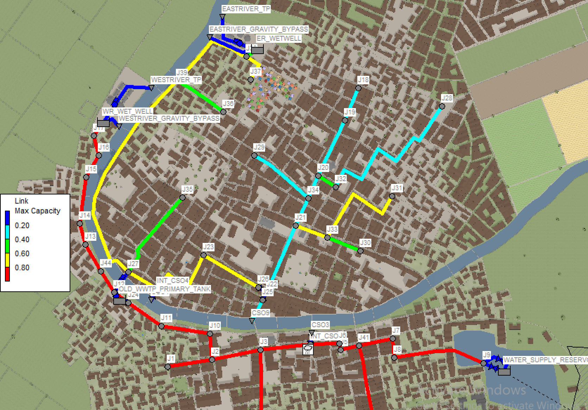
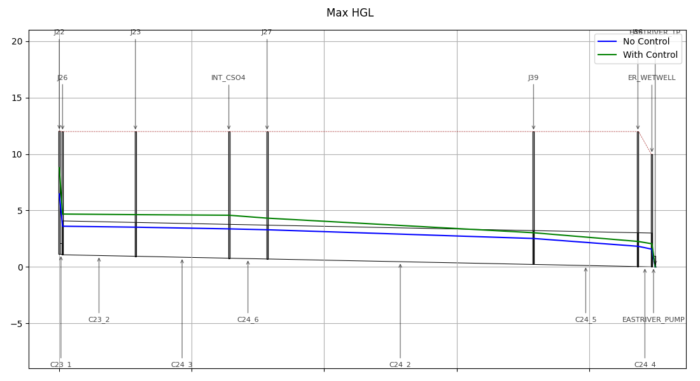
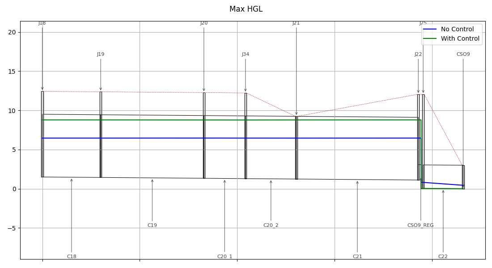
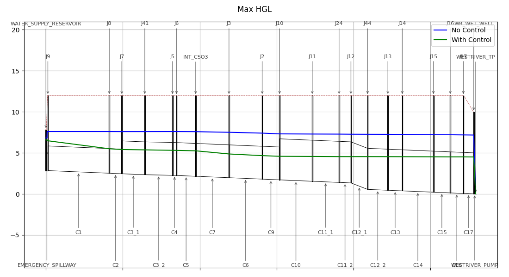

# WEF Collection Systems and Stormwater Conference 2024 - Workshop A: Smart Sewer Applications and Utility Experiences

Date: Mar 4th, 2024

Document Author(s): Bryant E. McDonnell - [Hydroinformatics, LLC](https://www.hydroinformatics.io), Constantine Karos - [Xylem](www.xylem.com), Luis Montestruque, [HydroDigital, LLC](https://www.hydrodigital.com/), Dayton Marchese, [OptiRTC](https://www.optirtc.com/), and Michael Tryby, USEPA

Copyright (c) 2024: Hydroinformatics, LLC

License: MIT License

Objective: Workshop Interactive Elements for Simulating Network Real Time Controls

---

The code and model were developed for the Water Environment Federation - Collection Systems and Stormwater Conference 2024. This concept was to create a real-world hydrologic and hydraulic network with some adverse hydraulic conditions (flooding, surcharging, combined sewer overflows). The attendees of the workshop will be guided to develop and leverage <u>existing</u> system assets within the hydraulic network by use of real time controls.

This scope of this code is to run the model as well as be a space where new control logic can be developed to operate the various controllable facilities.

---

### System Layout

### Compliance Objectives

- Zero Flooding (Flow surfacing and coming up out of the top of a maintenance hole)
- Zero CSO activations for the 1year storm event. Regulated by overflow site and fined $6,000 per activation. Activation == Overflow Volume > 0.001 MG.
- Zero Gravity bypasses at both WWTPs

### Key System Layout Details

- The city if serviced by two WWTPs
  - West River at 15 CFS peak | Gravity by-pass at 7ft wet-well depth
  - East River at 30 CFS peak | Gravity by-pass at 8ft wet-well depth
- Three CSOs:
  - North side of the river - CSO-4 and CSO-9. CSO-4 is on the East River Interceptor and CSO-9 was the end of the original sewer ages ago where they did some primary treatment before they built the East River TP.
  - South side of the river - CSO-3 situated on the West River Interceptor
- Nearby the river crossing the Old WWTP Primary Tanks are still connected to the system as "gravity flow in", "pump out." However, they are not used too frequently since there is a base cleaning cost ($7,000 per event). They can be used during emergencies. This tank is approximately 0.5MG capacity of usable storage.
- River Crossing (can be pumped from South to the North side of the river). This was built when they were in the process of decommissions the "Old WWTP" and after they expanded the East River TP
- The city drinking water reservoir is in the Southeast of town and has a dewater control gate as well as an emergency overflow. Due to topography, the emergency overflow runs into the combined sewer system. There is also a railroad running along the southern shoreline with limits build opportunities

### Hydraulic Constraint Challenges (Existing SOP)

- The city has no telemetered sensor data coming in and this is the reason they have opted for static control settings.
- Due to the side of the river, the West River TP is unable to procure the permit to discharge more.
- CSO-9 has an inflatable dam to limit overflow but the city does not have a good strategy in place to mange this asset and therefore leave it statically set. Every storm event that passes, a new adjustment is made.
- All CSOs use a brick to determine whether an overflow has occurred.
- The River Crossing Pump remains off since they do not have a good handle on preventing CSO4 from activating.

The results for the current 1-year SCS-Type3 Compliance Storm event are as follows:

| Volume Type              | No Control (MG) |
| ------------------------ | :-------------: |
| CSO3                     |      0.032      |
| CSO4                     |      0.000      |
| CSO9                     |      0.615      |
| WESTRIVER_TP             |     38.231      |
| WESTRIVER_GRAVITY_BYPASS |      4.246      |
| EASTRIVER_TP             |     32.557      |
| EASTRIVER_GRAVITY_BYPASS |      0.000      |
| FLOODING_VOLUME (KGal)   |      0.068      |

## Network Control Completed - Optimized

With Controls the network behaves as follows:

| Volume Type              | No Control (MG)          | W Control (MG)           |
| ------------------------ | ------------------------ | ------------------------ |
| CSO3                     | 0.032 :x:                | 0.000 :white_check_mark: |
| CSO4                     | 0.000 :white_check_mark: | 0.000 :white_check_mark: |
| CSO9                     | 0.615 :x:                | 0.000 :white_check_mark: |
| WESTRIVER_TP             | 38.231                   | 37.712                   |
| WESTRIVER_GRAVITY_BYPASS | 4.246 :x:                | 0.000 :white_check_mark: |
| EASTRIVER_TP             | 32.557                   | 39.641                   |
| EASTRIVER_GRAVITY_BYPASS | 0.000 :white_check_mark: | 0.000 :white_check_mark: |
| FLOODING_VOLUME (KGal)   | 0.068 :x:                | 0.000 :white_check_mark: |

#### East River Interceptor Peak Depth

#### CSO 9 Tributary Area Peak Depths

#### West River Interceptor Peak Depths

## Reference Packages Used

- SWMMIO
- PySWMM
- Matplotlib
