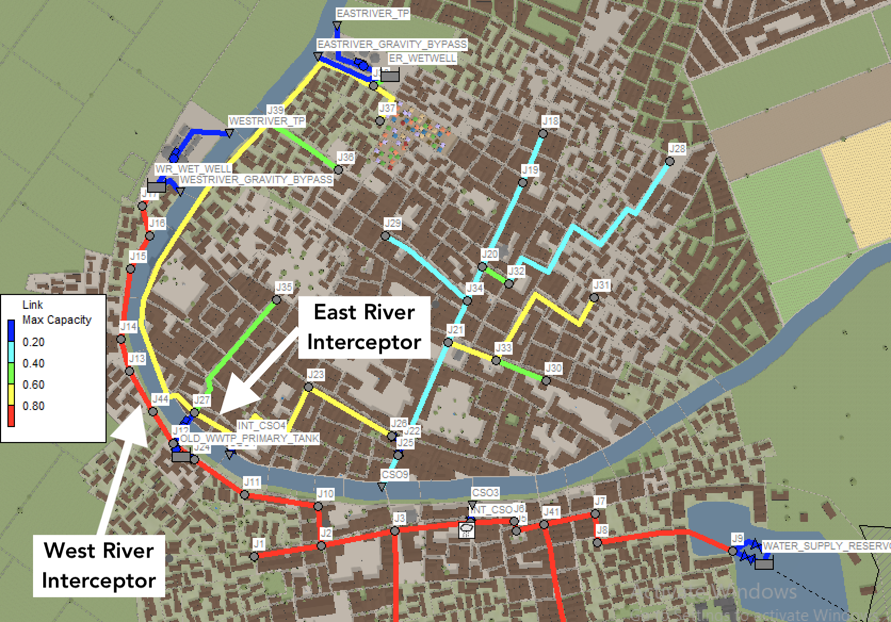

# WEF Collection Systems and Stormwater Conference 2024 - Workshop A: Smart Sewer Applications and Utility Experiences

Date: Mar 1st, 2024

Document Author(s): Bryant E. McDonnell, MS, PE, CP - [Hydroinformatics, LLC](https://www.hydroinformatics.io), Constantine Karos - [Xylem](www.xylem.com)

Objective: Workshop Interactive Elements for Simulating a Network Controls

______

This code / model was developed for the Water Environment Federation - Collection Systems and Stormwater Conference 2024.  This concept was to create a real-world hydrologic and hydraulic network with some adverse hydraulic conditions (flooding, surcharging, combined sewer overflows).  The attendees of the workshop are to be guided to propose and leverage available assets within the hydraulic network by use of real time controls.

This scope of this code is to run the model as well as be a space where new control logic can be developed to operate the various controllable facilities.

____

### Key System Layout Details

- The city if serviced by two WWTPs 
  - West River at 15 CFS peak | Gravity by-pass at 7ft wet-well depth
  - East River at 30 CFS peak | Gravity by-pass at 8ft wet-well depth
- Three CSOs:
  - North side of the river - CSO-4 and CSO-9.  CSO-4 is on the East River Interceptor and CSO-9 was the end of the original sewer ages ago where they did some primary treatment before they built the East River TP. 
  - South side of the river - CSO-3 situated on the West River Interceptor
- River Crossing (can be pumped from South to the North side of the river)
- Nearby the river crossing the Old WWTP Primary Tanks are still connected to the system as "gravity flow in", "pump out."  However, they are not used too frequently since there is a base cleaning cost.  They can be used during emergencies. This tank is approximately 0.5MG capacity of usable storage. 
- The city drinking water reservoir is in the Southeast of town and has a dewater control gate as well as an emergency overflow.  Due to topography, the emergency overflow runs into the combined sewer system.  There is also a railroad running along the southern shoreline with limits opportunities.  

### Hydraulic Constraint Challenges

- Due to the side of the river, the West River TP is unable to procure the permit to discharge more. 
- CSO-9 has an inflatable dam to limit overflow but the city does not have a good strategy in place to mange this asset and therefore leave it statically set.  Every storm event that passes, a new adjustment is made to ensure 
